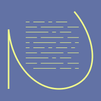

# Notepad

# 

### *created for General Assembly's SEI Course*

Goal: Create a full-stack CRUD applIcation 

Languages Used: HTML | CSS | Javascript

Stack: MongoDB Atlas | Express.js | Embedded Javascript | Node.js

* * *

## Requirements

1.  A working full-stack application, built by you, using Node.js, Mongoose, Express, & EJS
    
2.  Adhere to the MVC file structure: Models, Views, Controllers
    
3.  At least one model with all 7 RESTful routes and full CRUD.
    
4.  At least one Github commit per class day.
    
5.  Be deployed online and accessible to the public via Heroku - [notebook](https://git-this-notebook.herokuapp.com/)
    
6.  README.md file in the github repo with public link
    

## Features

- shows all characters in the Rick & Morty Universe in pages of 20
- search by name for characters
- filter by alive or dead characters
- next/previous buttons to display next 20 results (search and filter stays applied)

* * *

## Future Improvements

- search bar to query notebooks
- tooltips on notes
- another nav-like bar for file structure to allow more note organization
- drag-and-drop and more fun GUI
- use of authentication to allow private notebooks to be maintained
- use of sessions to allow shared "public-ish" notes and/or notebooks
- revamp of data structure. allowing logged in users and different types of notes for private or shared between other users
    - user
        - notebook1
            - noteA
            - noteB
        - notebook2
            - noteA
            - noteC
        - sharedNotebook3
            - sharedNoteD

* * *

## Challenges and Dev Logs: Next Time...

- This started as a to do list app, so my schema had to be redone a little bit, but more importantly, a lot of my code says "list" or "todolist" while the html reads "notes"/"notebook".
    
- I used this project as a way to experiment with both layouts and partials when using EJS files. It was very useful using a layout and saved a lot of copy-pasted code. I found some nice ways of displaying error messages with a partial as well.
    
- After doing some research, I decided that I was going to use try {} catch {} as well as async/await to deal with my routers and requests
    
- I stuck to vanilla css, as I needed a refresher on displays and wanted to learn animations in vanilla css before we move on to frameworks. It was tough doing this after building out my MVP, and with the app changing uses. I had trouble designing UI components that made sense, but am happy with the color scheme and detail of animations on this project.
    
- Responsive design wasn't as tricky since I went in with the mindset I would be using this on my phone.
    
- I really enjoyed using Figma to create some mock-ups and logos. The color scheme and logo were designed in Figma and were very easy to export
    
- It would have been nice to design this app with logins in mind. I feel like my schema and models are severly lacking from what a typical CRUD notes app would have...
    
- This is useful for me currently as a standalone crude cms. I'm able to jot down some notes and edit them later, or query them when I get enough of them. I use it in my current job and is *functional* on my phone and laptop.
